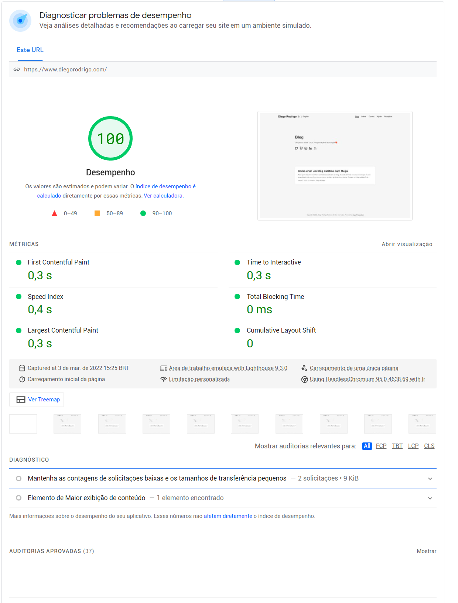

Para quem trabalha com T.I é bem interessante ter um blog, de certa forma é uma documentação do seu aprendizado, dá uma força no currículo e também ajuda a comunidade.

### O que é um blog estático?

Já utilizei muito WordPress e o desempenho nunca é lá essas coisas e sem contar que você precisa de um banco de dados e um servidor web com suporte a PHP, demais para um simples blog, não acha?

Um blog estático não precisa de nada disso, ele gera os arquivos HTML, CSS e Javascript e é tudo o que ele precisa para funcionar, o que deixa o site incrivelmente rápido.

Nunca antes com o WordPress o meu blog chegava a ese resultado:

<figure>

<figcaption align="center"><b>Performance testing with static blog</b></figcaption>
</figure>

### O que é o Hugo?

Hugo é um gerador de site HTML e CSS estático escrito em Go. Ele e rápido e fácil de utilizar, ele pega arquivos em um diretório e os transforma em um site HTML completo.

### Criando o blog

Antes de começarmos é necessário instalarmos o Hugo, é um processo simples mas como vai variar de acordo com o sistema operacional que você utiliza,
<a href="https://gohugo.io/getting-started/installing" target="_blank">sigas as instruções contidas aqui para realizar a instalação</a>.

Com o Hugo instalado já podemos criar o blog com o comando:

```bash
hugo new site blog
```

O Hugo irá criar uma pasta **blog** no diretório com os arquivos para o site, mas ainda é preciso escolhermos um tema.

Você pode escolher qualquer tema <a href="https://themes.gohugo.io/" target="_blank">aqui</a>, nesse tutorial irei utilizar o <a href="https://themes.gohugo.io/themes/etch/" target="_blank">Etch</a>.

Para isso rode os comandos:

```bash
cd blog
git init
git submodule add https://github.com/LukasJoswiak/etch.git themes/etch
```

Volte na pasta raiz do projeto e no arquivo `config.toml` e adicione a seguinte linha:

```toml
theme = "etch"
```

Pronto com isso você pode pode rodar o servidor em modo de desenvolvimento com o comando:

```bash
hugo server -D
```

### Criando seu primeiro artigo

Um blog não é nada sem um post e para criar seu primeiro post basta rodar o comando:

```bash
hugo new posts/hello-world.md
```

Isso cria o arquivo em `content/posts/hello-world.md` com o seguinte conteúdo:

```md
---
title: "Hello World"
date: 2022-03-02T17:17:22-03:00
draft: true
---
```

O Hugo utiliza de arquivos `.md` que utilizam <a href="https://www.markdownguide.org/getting-started/" target="_blank">markdown</a> para seu conteúdo, basta editar e alterar a opção `draft` para `false`, também pode adicionar o autor e tags e pronto, post publicado.

```md
---
title: "Olá mundo!"
date: 2022-03-02T17:17:22-03:00
draft: false
author: "Diego Rodrigo"
tags: ["tech", "golang"]
---

Conteúdo do post.
```

Viu como é fácil, agora é só hospedar seu blog em uma plataforma como a <a href="https://www.netlify.com/" target="_blank">Netfly</a> ou <a href="https://aws.amazon.com/pt/amplify/" target="_blank">AWS Amplify</a> e ser feliz😁.
